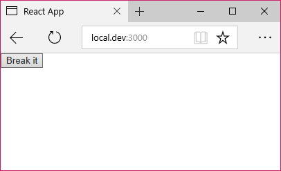

# Error Boundaries in React 16

```javascript
TypeError: Cannot read property '_currentElement' of null
```

If you've ever seen this error before, you've probably also discovered that it tends tell you nothing about the actual issue that lead to it. It's one of a number of indicators that there's a problem in one of your components, but it won't do much to tell you where or what the problem is. With the [release of React 16](https://facebook.github.io/react/blog/2017/09/26/react-v16.0.html) comes a new feature known as Error Boundaries, which hope to do away with the stack trace slog that usually follows an internal component error.

## What is an error boundary?

An error boundary is to React as `try...catch` is to plain old JavaScript. Using a new lifecycle method called `componentDidCatch`, we can catch (shocker) any errors thrown rendering a component deeper down the hierarchy, display a fallback UI, and handle the error gracefully instead of potentially breaking the whole app. This is significant, as previously such errors could throw React right off and leave you with a broken app and little information to start debugging.

## How do I implement it?

The `componentDidCatch` lifecycle method takes two arguments: `error` and `info`. `error` is the error thrown, while info contains extra data such as the component stack showing where in the component tree it began.

For a basic boundary component, we can implement just this new lifecycle method and `render`. In render we'll output `props.children` as usual unless something goes wrong, at which point we can log out the `info` argument and display a user-friendly error message.

```javascript
class ErrorBoundary extends Component {
  state = {
    error: false,
  };

  componentDidCatch(error, info) {
    this.setState({
      error: true,
    });
    console.log(info.componentStack);
  }

  render() {
    return this.state.error ? (
      <div>
        <h1>Uh oh!</h1>
        <p>Something&apos;s gone wrong 😬. Try refreshing the page.</p>
      </div>
    ) : (
      this.props.children
    );
  }
}
```

To test this out, we need a component which we can easily break. Let's make a button which intentionally triggers an error while rendering.

```javascript
class Breaker extends Component {
  state = {
    shouldThrow: false,
  };

  throwError() {
    throw new Error('Whoopsie! 😇');
  }

  render() {
    if (this.state.shouldThrow) this.throwError();

    return (
      <button onClick={() => this.setState({ shouldThrow: true })}>
        Break it
      </button>
    );
  }
}
```

Now all we need to do is wrap the `Breaker` component with our `ErrorBoundary` and watch it work. The boundary will catch anything thrown while rendering a component hierarchically inside it (not just immediate children), and you can also nest them to provide more specific messages and keep the remainder of your app functioning normally.

```javascript
ReactDOM.render(
  <ErrorBoundary>
    <Breaker />
  </ErrorBoundary>,
  document.getElementById('root'),
);
```

Here's how it looks when you load the app:



And after you hit 'break it':


Much better than a cryptic console error and unresponsive app, right? And pretty easy to implement! This is one of a many [features in React 16](https://facebook.github.io/react/blog/2017/09/26/react-v16.0.html) which greatly improve the experience for users and developers alike.

The full source code for the demo above is [on my github](https://github.com/callummr/error-boundary-demo), and if you have any questions feel free to reach out to me on Twitter [@callummr](https://twitter.com/callummr).